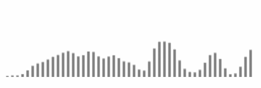

# 首先看成品



## 特点

- 稳定且柔和的变化
- 灵活的响应
- 总体居中的波动

---

## 试一试

- ::github{repo="ZOUYIQAQ/js-music-visualization"}
- **在线尝试[demo](https://zouyiqaq.github.io/js-music-visualization/)**

---

# 前置知识

1. 使用`getByteFrequencyData`函数获取的数据为频域数据. 由此数据制成的图称为频谱图.
2. 频谱图x轴代表频率, y轴代表能量强度值.
3. 你需要先学会[基于 Web Audio API 实现音频可视化效果](https://developer.mozilla.org/zh-CN/docs/Web/API/Web_Audio_API/Visualizations_with_Web_Audio_API), 然后再来看这篇文章. 这篇文章的重点在如何`让可视化更好看`, 而不是`从零开始创建可视化`
4. 大致了解[各个乐器的频率分布](https://www.cnblogs.com/dylancao/p/10097946.html)

# 基本的可视化搭建

首先需要参考[基于 Web Audio API 实现音频可视化效果](https://developer.mozilla.org/zh-CN/docs/Web/API/Web_Audio_API/Visualizations_with_Web_Audio_API)来完成基本的可视化创建.

创建完成的网页上的可视化应该类似这样:

简单观察, 我们能发现该可视化有以下问题:

1. 频谱图左大右小
2. 频谱图看起来锯齿化严重
3. 频谱图无法准确反映音乐信息

确定了问题, 接下来我们就需要来修复这些问题, 以达到最开始示例图的效果.

# 可视化完善

## 左大右小的解决

在前置知识中应该了解到频谱图的x轴代表频率, y轴代表能量强度. 因此我们可以意识到, 想要解决此问题, 无法就是两点:  

1. 根据频率切割数据, 只留下需要的频段.
2. 增大高频区, 减小低频区的值.

在明白问题和解决方案以后, 问题就好解决了, 下面是拟解决代码, 尚有优化空间:

```js
(start_f, end_f, numPoints) => {
    // 获取采样率
    const sampleRate = this.audCtx.sampleRate;
    // 计算频率对应的索引
    const binCount = this.analyser.frequencyBinCount;
    const start_index = Math.floor(start_f /(sampleRate / 2) * binCount);
    const end_index = Math.ceil(end_f / (sampleRate /2) * binCount);
    // 截取频率段
    const cutData = Array.from(this.dataArray.slic(start_index, end_index));
    // 调整数据个数, 这是直接从demo中截取的代码, 这一步在此可以跳过
    return this.#canonical_size(cutData, numPoints);
}
```

不仅如此, 为了数据的方便处理, 还可以对数据进行归一化, 然后再经过缩放后恢复, 从而让数据分布更为平均:

```js
(array, maxValue) => {
    // 找出数组中的最小值和最大值
    const min = Math.min(...array);
    const max = Math.max(...array);
    // 如果所有值都相同，则返回全为最大值/2的数组
    if (min === max) return array.map(_ => 1)
    // 规范化数组中的每个值
    const normalizedArray = array.map((value, index) => {
        // 线性变换放大差距后进行反线性变换
        let _data = (((value - min) / (max - min)) ** 2) * maxValue
        // 调整数据使其更美观
        if (index > 20) _data = _data * 1.5
        if (index <= 15) _data = _data * 0.8
        return _data > 1 ? _data > maxValue ? maxValue : _data : 1
    })
    return normalizedArray
}
```

## 锯齿化严重的解决

对于锯齿化, 我们可以采用平滑和去噪的方式来进行处理.

方便起见, 我使用了高斯平滑.

```js
(data, sigma, kernelSize) => {
    const gaussianKernel = [];
    let kernelSum = 0;
    const halfSize = Math.floor(kernelSize / 2);
    // 计算高斯核
    for (let i = -halfSize; i <= halfSize; i++) {
        const value = Math.exp(-(i * i) / (2 * sigma * sigma));
        gaussianKernel.push(value);
        kernelSum += value;
    }
    // 归一化高斯核
    for (let i = 0; i < gaussianKernel.length; i++) {
        gaussianKernel[i] /= kernelSum;
    }
    // 应用高斯平滑
    const smoothedData = [];
    for (let i = 0; i < data.length; i++) {
        let smoothedValue = 0;
        for (let j = -halfSize; j <= halfSize; j++) {
            const index = i + j;
            if (index >= 0 && index < data.length) {
                smoothedValue += data[index] * gaussianKernel[j + halfSize];
            }
        }
        smoothedData.push(smoothedValue);
    }
    return smoothedData;
}
```

## 无法准确反映音乐节奏的解决

理想中的可视化, 应当是随着音乐的变化, 波浪也随之不断变化, 高潮迭起而起伏有致.

但事实上画出来的图是一会一个样, 在制作可视化时, 这个问题困扰了我许久. 但我相信, 在了解了前置知识后, 你应该能很快想出解决方案.

一会一个样, 是因为更新的速度过快, 且每次都数据都大不一样.

而无法反映音乐的节奏则是因为展示的数据过大, 而想要展示的频段却太小.

所以我们可以采用加长音频持续时间和切片的方案来解决. 因为切片上面已经展示过了, 所以下面只有加长音乐持续化的部分代码.

为了方便理解, 这里大致解释一下代码的做法, 即:
> 将历史数据保存起来, 取一定时间内的平均值, 最后展示平均值, 使得数据变化更加的平滑和缓慢.

```js
(_list) => {
    this.window_list.push(_list)
    if (this.window_list.length > this.window_size) {
        const del_num = this.window_list.length - this.window_size
        for (let i = 1; i <= del_num; i++) {
            this.window_list.shift()
        }
    }
    return this.#calculateAverageOfLists(this.window_list)
}
```

## 其他问题

### 颜色

在阅读[基于 Web Audio API 实现音频可视化效果](https://developer.mozilla.org/zh-CN/docs/Web/API/Web_Audio_API/Visualizations_with_Web_Audio_API)时, 我相信你们就已经了解到了这一点, 为表添加好看的颜色会让表更好看.

只需要设置`strokeStyle`和`fillStyle`的值就好了, 下面是示例代码:

```js
() => {
    this.ctx.clearRect(0, 0, this.width, this.height)
    this.ctx.beginPath()
    this.ctx.strokeStyle = `rgba(${this.rgba[0]}, ${this.rgba[1]}, ${this.rgba[2]}, ${this.rgba[3]})`
    this.ctx.fillStyle = `rgba(${this.rgba[0]}, ${this.rgba[1]}, ${this.rgba[2]}, ${this.rgba[3]})`
    this.ctx.lineWidth = 3
    this.ctx.beginPath()
}
```

### 柱体个数

同样是为了画出的图表更好看, 我们可以设置切片后的数据个数, 从而简化工作量和加快速度. 下面是示例代码:

```js
(data, newSize) => {
    // 结果数组
    let result = [];
    // 原始数据大小
    const originalSize = data.length;
    // 遍历新数组的每个位置
    for (let i = 0; i < newSize; i++) {
        // 计算在原始数据中对应的位置
        const pos = (i * (originalSize - 1)) /(newSize - 1);
        // 计算pos的整数部分和小数部分
        const baseIndex = Math.floor(pos);
        const fraction = pos - baseIndex;
        // 如果pos刚好在整数位置或为最后一个位置，则直接值
        if (fraction === 0 || baseIndex ===originalSize - 1) {
            result.push(data[baseIndex]);
        } else {
            // 线性插值计算
            result.push(data[baseIndex] + (dat[baseIndex + 1] - data[baseIndex]) *fraction);
        }
    }
    return result;
}
```

### 柱体间距

在学习[基于 Web Audio API 实现音频可视化效果](https://developer.mozilla.org/zh-CN/docs/Web/API/Web_Audio_API/Visualizations_with_Web_Audio_API)时, 我相信你也能注意到它的一个问题, 就是这些柱体实在**离得太近了**! 这样画出来的图显得臃肿不堪, 因此我们要在柱体间留有间距.

这一点也十分好实现, 只需要在绘图时将柱体的宽度除二, 然后再在下个柱体的x轴坐标上添加柱体宽度即可.

不过这只是简单的处理, 如果需要更多更细致的处理还需要多加处理.

```js
() => {
    requestAnimationFrame(this.histogram)
    if (!this.isInit) return
    this.#init_draw()
    const show_data = this.#init_data()
    this.ctx.clearRect(0, 0, this.width, this.height);
    const barWidth = this.width / show_data.length
    show_data.forEach((value, index) => {
        const barHeight = value / 100 * this.height
        const x = index * barWidth + barWidth
        const y = this.height - barHeight
        this.ctx.fillRect(x, y, barWidth / 2, barHeight)
    })
}
```

# 结语
其实一路写下来, 并没有什么技术上的难题. 仔细想想, 当时在画图时遇到了这么多困难其实全是来源于知识的不足.

一开始我甚至连这图叫什么都不知道, 想要获取更多相关的专业知识也是无济于事.

最后在GPT的帮助下才了解到一些相关的信息, 但是仍然只能画出最基本的频谱图, 就是最烂的那种.

最后搜寻其他的音乐可视化方式时了解到了ae的工作方式. 就是最大高度, 频率范围那些. 这才完成了整个可视化的绘制.

# 鸣谢

> - **每个文章中用到的链接**
> - ::github{repo="gg-1414/music-visualizer"}
> - ::github{repo="HTML50/audioVisualizer"}